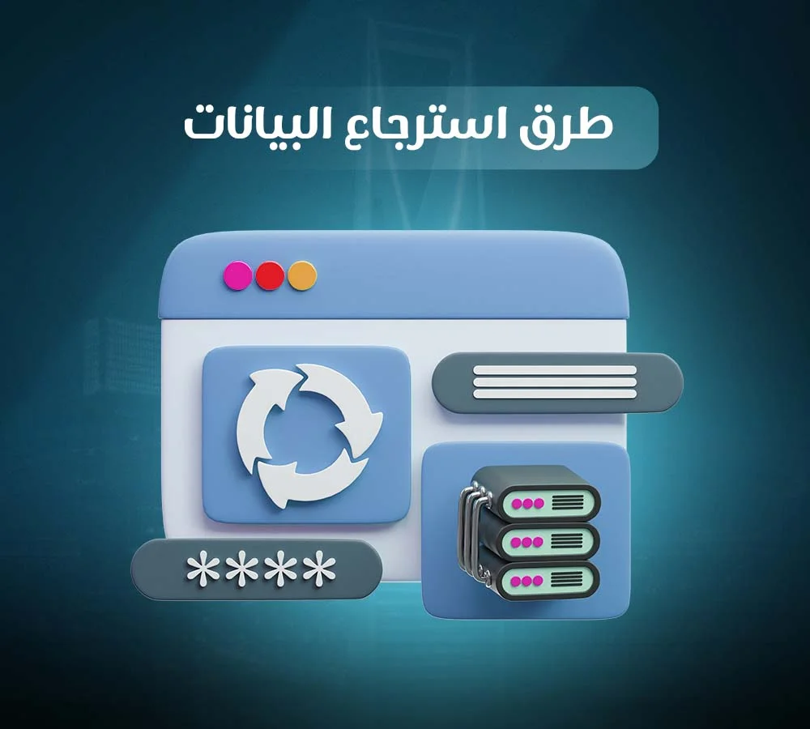

## **استرجاع البيانات: الخدمات والحلول المتاحة**

تخيل أن تفتح جهاز الكومبيوتر الخاص بك ذات صباح لتجد أن جميع صور العائلة التي التقطتها على مدار سنوات، أو عقود العمل المهمة التي أنجزتها، أو قاعدة بيانات شركتك، قد اختفت فجأة. هذا ما يمر به الملايين حول العالم كل يوم، لكن فقدان البيانات لا يعني نهاية المطاف. حيث أن هناك حلول فعالة متاحة اليوم من خلال برامج متخصصة يمكنك استخدامها بنفسك، أو عبر خدمات متخصصة من شركة [**من الصفر الى الواحد لاستجاع البيانات**](https://datarecovery-sa.com/about.html) تعيد لك ما فُقد.

## **ما المقصود باسترجاع البيانات (استعادة البيانات)؟**

استرجاع البيانات هو عملية إعادة الوصول إلى ملفات محذوفة أو غير قابلة للقراءة بسبب حذفها بشكل بشري، أو عطل تقني، أو تلف في نظام التخزين. ببساطة، هي محاولة إنقاذ ما يمكن إنقاذه من معلوماتك الرقمية عبر خبراء **من الصفر الى الواحد**. قد تجد البعض يسميها "استعادة بيانات"، وآخرون "استرجاع ملفات"، والبعض يستخدم المصطلح "Data Recovery"، لكن جميعها تشير لنفس المعنى.

## **أشهر أسباب فقدان البيانات**

تتنوع الأسباب التي تؤدي إلى فقدان البيانات، لكن الأكثر شيوعاً:

- **الحذف الخاطئ:** مسح ملف بالخطأ وتفريغ سلة المحذوفات.
- **تهيئة الجهاز (format) عن غير قصد:** ضغط زر التهيئة للقرص الصلب أو بطاقة الذاكرة وأنت تظن أنك تقوم بعمل آخر.
- **تلف القرص الصلب:** نتيجة الصدمات، أو تآكل الأجزاء الميكانيكية، أو عيوب التصنيع.
- **الفيروسات:** تشفر ملفاتك أو تحذفها تماماً.
- **انقطاع الكهرباء المفاجئ:** أثناء نقل الملفات أو تحديث النظام، مما يتسبب في تلف بنية البيانات.
- **تلف بطاقة الذاكرة أو الفلاش ميموري:** بسبب الاستخدام المتكرر، أو الإزالة الخاطئة أثناء التشغيل. 

## **طرق استرجاع البيانات المتاحة اليوم**

ينقسم حل مشكلة فقدان البيانات إلى مسارين رئيسيين، لكل منهما استخداماته المناسبة:

- **برامج استعادة الملفات المحذوفة:** هذه الأدوات البرمجية هي الخيار الأول للعديد من المستخدمين، وهي مناسبة في الحالات البسيطة مثل حذف ملف من القرص الصلب دون أن يتم الكتابة فوق موقعه بعد ذلك. تعمل هذه البرامج عن طريق مسح القرص بحثاً عن بقايا الملفات المحذوفة وإعادة تجميعها. لكن احذر بمجرد أن تكتشف فقدان ملف، توقف فوراً عن استخدام الجهاز، فكل عملية كتابة جديدة على القرص تقلل فرص نجاح الاسترجاع، لأن النظام قد يكتب فوق المساحات التي كانت تحتوي على بياناتك المفقودة. 
- **خدمة استرجاع بيانات احترافية متخصصة:** عندما تفشل البرامج، أو عندما تكون البيانات شديدة الحساسية، أو عندما يصدر القرص الصلب أصوات غريبة، هنا يأتي دور الخدمات الاحترافية في **من الصفر الى الواحد**. هذه الفرق المتخصصة تمتلك غرفاً نظيفة (Clean Rooms) وأدوات متقدمة لتفكيك الأقراص التالفة فعلياً وقراءة البيانات من مكوناتها الداخلية. المحاولة غير المتخصصة في مثل هذه الحالات قد تؤدي إلى فقدان البيانات نهائياً. 

## **كيف تسير عملية استرجاع البيانات الاحترافية خطوة بخطوة؟**

عندما تقرر اللجوء إلى خدمة متخصصة مثل **من الصفر الى الواحد**، تمر العملية عادة بأربع مراحل منظمة:

- **الفحص والتشخيص المبدئي:** يفحص الفنيون الجهاز لتحديد طبيعة العطل، وهل هو برمجي أم مادي.
- **تقييم الحالة وتحديد نسبة النجاح المتوقعة:** بناء على التشخيص، يقدّر مدى إمكانية استعادة البيانات، ويُعرض عليك التقرير دون تكلفة في معظم المراكز الموثوقة.
- **الاسترجاع الفعلي في بيئة آمنة:** تبدأ عملية الاستعادة باستخدام الأدوات المناسبة، سواء برمجيات متخصصة أو أجهزة هندسية عكسية، مع التأكد من عدم التسبب في أي ضرر إضافي.
- **تسليم البيانات بعد التحقق من سلامتها:** تعاد لك الملفات المسترجعة على وسيط تخزين جديد، بعد فحصها للتأكد من صلاحيتها وسلامة محتواها.

الفحص الأولي لا يكلّفك شيئاً ولا يتم اتخاذ أي إجراءات تنفيذية إلا بعد موافقتك المسبقة على خطة العمل والتكلفة المقترحة. 

## **استعادة البيانات في الرياض، لماذا تختار مزوداً محلياً؟**

إذا كنت في الرياض أو المناطق المجاورة، فإن التعامل مع مركز متخصص محلي مثل **من الصفر الى الواحد** يمنحك مزايا متعددة، مثل:

- **سرعة الاستجابة:** بدل الانتظار لأيام مع مقدمي الخدمات البعيدة، ستحصل على رد فوري من الخبراء المحليين.
- **تسليم الجهاز يدوياً:** يمكنك التوجه شخصياً إلى المركز، ومتابعة التشخيص مما يمنحك ثقة وراحة أكبر.
- **فهم أفضل للبيئة المحلية:** المراكز المحلية تدرك طبيعة الأجهزة والبرامج المستخدمة في السوق السعودي، وتعرف التحديات الشائعة لدى المستخدمين هنا.
- **الدعم باللغة العربية:** التواصل بلغتك الأم يزيل أي غموض حول التفاصيل الفنية والتعليمات.

هذا لا يعني أن الخدمات العالمية غير مفيدة، لكن حين يتعلق الأمر ببيانات حساسة وعاجلة، فالقرب المحلي لخبراء **من الصفر الى الواحد** يصبح ميزة تنافسية. 

## **نصائح للوقاية من فقدان البيانات مستقبلاً**

إليك 4 نصائح عملية تحميك من فقدان البيانات:

- **اعتماد النسخ الاحتياطي الدوري:** احتفظ بنسخ متعددة من ملفاتك المهمة، سواء على السحابة الإلكترونية أو على أقراص صلبة خارجية.
- **لا تفصل الجهاز فجأة أثناء النقل:** تأكد دائماً من إتمام عملية نقل الملفات أو فصل القرص بأمان عبر النظام قبل إزالته.
- **حدّث برامج الحماية من الفيروسات:** برامج الفدية والبرامج الخبيثة تتطور يومياً، لذا احرص على تحديث نظام الحماية باستمرار.
- **أوقف الجهاز فور سماع صوت غير طبيعي:** إذا صدر من القرص الصلب صوت طقطقة أو نقر غير معتاد، أوقف التشغيل فوراً ولا تكرر المحاولة، فكل تشغيلة إضافية قد تزيد التلف الفعلي.

## **الأسئلة الشائعة (FAQ)**

### **س1: ما الفرق بين استرجاع البيانات واستعادة البيانات وداتا ريكفري؟**

لا فرق حقيقي بين المصطلحات الثلاثة، فكلها تشير لنفس العملية وهي إعادة الوصول لبيانات محذوفة أو تالفة، لكن الناس يستخدمون كل مسمى حسب تعوّدهم.

### **س2: هل يمكن استرجاع الملفات المحذوفة نهائياً من سلة المحذوفات؟**

نعم غالباً، ما دام لم يٌكتب فوق المساحة التي كان يشغلها الملف بيانات جديدة. كلما توقفت عن استخدام الجهاز بشكل أسرع بعد الحذف، زادت فرصة الاسترجاع عبر خبراء **من الصفر الى الواحد**.

### **س3: متى استخدم برنامج استعادة الملفات المحذوفة بنفسي، ومتى ألجأ لشركة متخصصة؟**

البرنامج مناسب للحذف البسيط على جهاز يعمل بشكل طبيعي. أما إذا كان الهارد تالفاً فعلياً، يصدر صوتاً غريباً، أو البيانات حساسة ومهمة جداً، فالأفضل اللجوء لخدمة متخصصة مثل **من الصفر الى الواحد** لتفادي فقدان البيانات نهائياً بمحاولة غير احترافية.

### **س4: هل استخدام برامج استعادة الملفات آمن على البيانات الأصلية؟**

بشكل عام نعم إذا كانت من مصدر موثوق، لكن يٌفضّل عدم تثبيت البرنامج على نفس القرص الذي تريد استرجاع الملفات منه لتقليل خطر الكتابة فوق البيانات المفقودة.

### **س5: هل تتوفر خدمة استعادة البيانات في الرياض بشكل سريع؟**

نعم، التعامل مع مزود محلي بالرياض مثل **من الصفر الى الواحد** يسمح عادة بفحص الجهاز وتسليمه شخصياً، مما يسرّع عملية التشخيص والاسترجاع مقارنة بالشحن لجهة خارجية.

### **س6: كم تستغرق عملية استرجاع البيانات عادة؟**

تختلف المدة حسب حالة الجهاز ونوع العطل، الحالات البسيطة قد تُحل خلال ساعات، بينما الأعطال الفعلية بالهارد ديسك قد تحتاج عدة أيام لإتمام الفحص والاسترجاع بأمان عبر تقنياتنا في **من الصفر الى الواحد**.

**الخاتمة**

خلاصة القول أن البرامج المنزلية كافية لاستعادة الملفات المحذوفة البسيطة، لكن عندما يتعلق الأمر بقرص صلب تالف فعلياً، أو بيانات شديدة الحساسية، أو موقف يتطلب خبرة فعلية، فلا تتردد في الاتصال بفريق متخصص. المخاطرة بتجربة حلول غير ملائمة قد تكلفك فقدان بياناتك للأبد. 

إذا كنت تواجه أي مشكلة في الوصول إلى ملفاتك، أو تسمع صوتاً غريباً من قرصك الصلب، أو تعرضت لفورمات مفاجئ، لا تتردد وتأكد من أن بياناتك في أمان تام، [**تواصل مع خبراء من الصفر الى الواحد لاسترجاع البيانات**](https://datarecovery-sa.com/contact.html) اليوم لطلب فحص مبدئي مجاني. فريقنا المحترف في الرياض على أتم الاستعداد لتشخيص حالتك وتقديم خطة عمل واضحة قبل أي التزام من جانبك.
