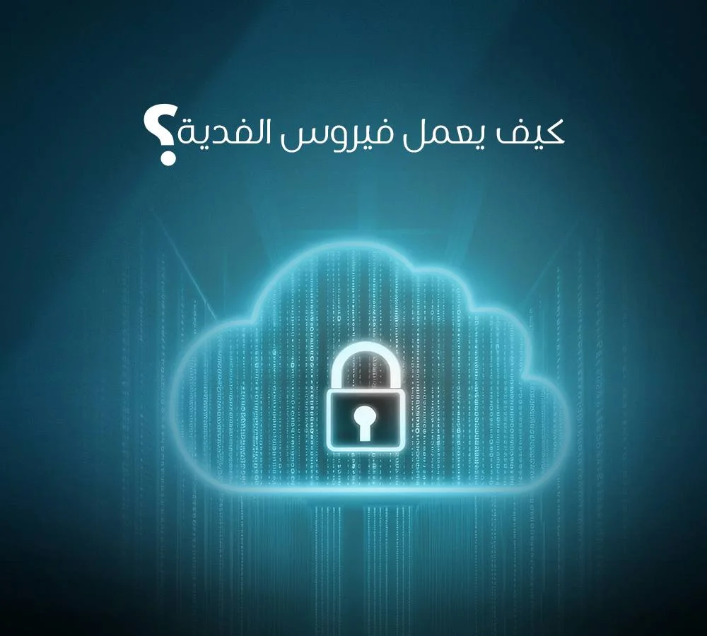
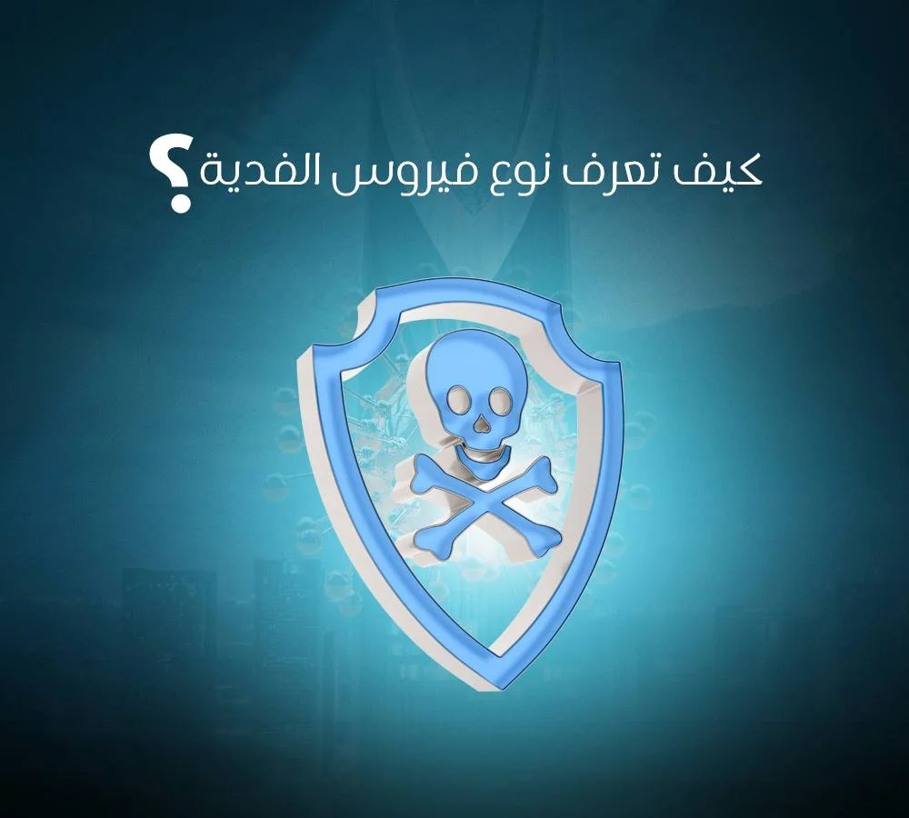

## **ما هو فيروس الفدية (Ransomware)**

[فيروس الفدية (Ransomware) ](https://datarecovery-sa.com/services/ransomware.html)هو نوع خطير من البرمجيات الخبيثة التي تتسلل إلى الأجهزة وتستخدم خوارزميات تشفير معقدة لقفل الملفات أو النظام بالكامل، ثم تطالب الضحية بدفع مبلغ مالي، غالباً بالعملات الرقمية المشفرة، مقابل مفتاح فك التشفير واستعادة الوصول إلى البيانات. تتنوع هذه الهجمات بدءاً من تشفير الملفات الشخصية البسيطة وصولاً إلى هجمات الابتزاز المزدوج التي تستهدف الشركات بتهديدها بنشر بياناتها الحساسة للعلن. وفي ظل تصاعد هذه الهجمات، يصبح التدخل الاحترافي السريع من قبل خبراء **من الصفر الى الواحد** لاسترجاع البيانات وتطبيق سياسات الأمان الصارمة هو درع الوقاية الأول لضمان عدم فقدان الأصول الرقمية.

## **كيف يعمل فيروس الفدية تقنياً؟**

فيروس الفدية ليس مجرد فيروس عادي يهدف إلى إتلاف النظام، بل هو أداة ابتزاز مالي متطورة. بمجرد دخوله إلى الجهاز، يبدأ الفيروس بالعمل في صمت، حيث يقوم بمسح الأقراص الصلبة والشبكات المتصلة بحثاً عن الملفات ذات الأهمية (مثل المستندات المالية، قواعد البيانات، الصور، والمقاطع الصوتية والمرئية). يستخدم الفيروس خوارزميات تشفير قوية جداً (مثل RSA أو AES) تجعل من المستحيل تقريباً فتح الملفات بدون مفتاح فك التشفير الخاص الذي يحتفظ به المهاجم. وبعد اكتمال عملية التشفير، تظهر للمستخدم رسالة الفدية التي تتضمن تعليمات الدفع، ووقت زمني محدد للمطالبة بمضاعفة المبلغ أو حذف المفتاح نهائياً.

## **كيف تصل فيروسات الفدية إلى الأجهزة والشبكات؟**

تعتمد هذه البرمجيات على استغلال الثغرات التقنية والأخطاء البشرية:

- **رسائل التصيد الاحتيالي (Phishing & Spear,Phishing):** أصبحت موجهة بعناية، قد يتلقى الموظف رسالة تبدو وكأنها من مديره المباشر أو من جهة حكومية تحتوي على ملف بصيغة (PDF أو Word) ملغم ببرمجية خبيثة تبدأ بالتنفيذ بمجرد النقر عليها.
- **استغلال بروتوكول سطح المكتب البعيد (RDP):** يعتبر من أخطر الثغرات في الشركات. يقوم المهاجمون باستخدام برامج لتخمين كلمات المرور لمنافذ RDP المفتوحة على الإنترنت، وبمجرد الدخول، يصبح لديهم تحكم كامل لتعطيل برامج الحماية وزرع الفيروس.
- **التحميل الخفي (Drive,by Downloading):** مجرد زيارة موقع ويب مخترق قد يؤدي إلى تحميل الفيروس تلقائياً في خلفية نظامك دون الحاجة للنقر على أي زر تحميل، وذلك عبر استغلال ثغرات المتصفح.
- **الإعلانات الخبيثة (Malvertising):** يتم دس أكواد خبيثة داخل إعلانات تظهر على مواقع شرعية وموثوقة، وبمجرد ظهور الإعلان أو النقر عليه، تبدأ عملية اختراق الجهاز.

## **أشهر أنواع فيروس الفدية**

| **نوع الفيروس** | **آلية العمل التقنية** | **الأثر ومستوى الخطورة** | **أمثلة شهيرة** |
| تشفير الملفات (Crypto Ransomware) | يبحث عن امتدادات ملفات محددة ويقوم بتشفير محتواها وتغيير امتدادها. | مرتفع: يفقد المستخدم الوصول لبياناته الحيوية، لكن النظام يستمر في العمل. | WannaCry, Locky, Ryuk |
| قفل الجهاز (Locker Ransomware) | لا يشفر الملفات الفردية، بل يقفل واجهة المستخدم (شاشة الدخول) ويمنع الوصول للنظام. | متوسط: البيانات غالباً غير مشفرة، ويمكن لخبراء التقنية تخطي واجهة القفل. | Reveton, WinLocker |
| الابتزاز المزدوج (Double Extortion) | يقوم بنسخ وسرقة البيانات الحساسة إلى خوادم المهاجمين أولاً، ثم يشفرها في جهاز الضحية. | حرج جداً: خطر ابتزاز بنشر البيانات السرية للجمهور أو المنافسين. | REvil, Maze, DarkSide |
| برمجيات الفدية كخدمة (RaaS) | نموذج عمل يقوم فيه مطور الفيروس بتأجيره لقراصنة آخرين مقابل نسبة من الأرباح. | متصاعد: سمح لغير الخبراء بشن هجمات مدمرة، مما ضاعف من عددها عالمياً. | Conti, Cerber |

## **كيف تعرف نوع فيروس الفدية الذي أصاب جهازك؟**

تحديد نوع الفيروس بدقة يوفر الكثير من الوقت والجهد على الخبراء في شركة **من الصفر الى الواحد**:

- **مراقبة التغيير في امتدادات الملفات:** معظم الفيروسات تضيف بصمتها الخاصة للملف، فمثلاً يتحول ملف "تقرير.docx" إلى "تقرير.docx.locked" أو سلسلة من الأحرف العشوائية.
- **تحليل رسالة الفدية:** اقرأ الملف النصي المتروك على سطح المكتب (مثل README.txt). عنوان البريد الإلكتروني للمهاجم أو تصميم الرسالة يكشف غالباً عن عائلة الفيروس.
- **أدوات التحليل المجانية:** مشاريع متخصصة تتيح لك رفع عينة من الملف المشفر ورسالة الفدية لتحليلها وتحديد ما إذا كان هناك مفتاح فك تشفير متاح.

## **ماذا تفعل فور اكتشاف الإصابة؟ (خطوات التدخل السريع)**

التصرف في الدقائق الأولى يحدد مصير بياناتك. تجنب الذعر واتبع الآتي بدقة:

- **العزل الفوري للشبكة:** افصل كابل الإنترنت وأوقف تشغيل شبكة اللاسلكي والبلوتوث فوراً لمنع انتقال الفيروس إلى الخوادم الرئيسية أو أجهزة الزملاء.
- **فصل أجهزة التخزين الخارجية:** إذا كان هناك قرص صلب خارجي أو وحدة ذاكرة متصلة، افصلها فوراً قبل أن يطالها التشفير.
- **عدم إيقاف تشغيل الجهاز بالقوة:** يفضل وضع الجهاز في حالة السبات (Hibernation) إن أمكن، لأن بعض مفاتيح التشفير قد تكون محفوظة في الذاكرة العشوائية والتي تُمحى عند إطفاء الجهاز.
- **تجنب محاولة إصلاح الملفات بنفسك:** تغيير امتدادات الملفات يدوياً قد يؤدي إلى تلف تشفير الملف نهائياً وجعله غير قابل للاسترجاع.
- **الاستعانة بالمختصين:** تواصل فوراً مع فريق **من الصفر الى الواحد** لاسترجاع البيانات، حيث يمتلك خبراؤنا تقنيات متقدمة لتحليل القرص الصلب و[استرجاع الملفات بأمان](https://datarecovery-sa.com/blog/data-recovery-services-riyadh/).

## **استراتيجية الحماية الدائمة للأفراد والشركات**

الوقاية تظل أقل تكلفة بكثير من محاولات العلاج:

- **قاعدة النسخ الاحتياطي (1,2,3):** احتفظ بثلاث نسخ من بياناتك المهمة، على وسيطين مختلفين للتخزين، مع الاحتفاظ بنسخة واحدة مفصولة تماماً عن شبكة الإنترنت.
- **تقسيم الشبكات (Network Segmentation):** تقسيم الشبكة يضمن أن إصابة جهاز في قسم معين لن تنتقل إلى خوادم قواعد البيانات الرئيسية.
- **أنظمة الكشف والاستجابة (EDR):** تراقب هذه الأنظمة السلوك غير الطبيعي في الأجهزة وتوقف عمليات التشفير في ثوانيها الأولى قبل أن تتفاقم.
- **إدارة الصلاحيات (Least Privilege):** لا تمنح صلاحيات مسؤول النظام للموظفين إلا عند الضرورة القصوى.

## **الأسئلة الشائعة (FAQ)**

### **ما هو فيروس الفدية باختصار؟**

هو برنامج خبيث يشفّر ملفات الجهاز أو يمنع الوصول إليه، ثم يطالب بدفع مبلغ مالي مقابل استعادة الوصول إلى البيانات.

### **ما الفرق بين فيروس الفدية والفيروسات العادية؟**

الفيروسات العادية قد تتلف الملفات أو تبطئ أداء الجهاز، بينما فيروس الفدية يشفّر البيانات عمداً ويطلب فدية مالية لفك التشفير.

### **هل يجب دفع الفدية لاسترجاع الملفات؟**

لا يُنصح بذلك مطلقاً، فدفع الفدية لا يضمن استرجاع الملفات فعلياً. الأفضل هو التواصل مع خبراء **من الصفر الى الواحد** لتقييم الحالة بطريقة احترافية.

### **هل يمكن استرجاع الملفات المشفرة بفيروس الفدية بدون دفع الفدية؟**

في بعض الحالات نعم، خصوصاً عبر تدخل فريق **من الصفر الى الواحد** لتقييم الحالة بدقة وتقديم الحلول التقنية المناسبة لاسترجاع بياناتك.

فيروسات الفدية لم تعد مجرد حوادث عابرة، بل صناعة إجرامية منظمة ومربحة. دفع الفدية لا يضمن لك استعادة بياناتك، بل يجعلك هدفاً مستقبلياً ويدعم استمرار هذه الهجمات. الاستثمار في أنظمة الحماية، وتدريب الكوادر، والاعتماد على خطط نسخ احتياطي محكمة هو السبيل الوحيد للنجاة. وإذا وقعت الكارثة، لا تتردد، [**تواصل مع خبراء من الصفر الى الواحد لاسترجاع البيانات**](https://datarecovery-sa.com/contact.html) لضمان عودة أعمالك بأمان وبأقل الخسائر الممكنة.
