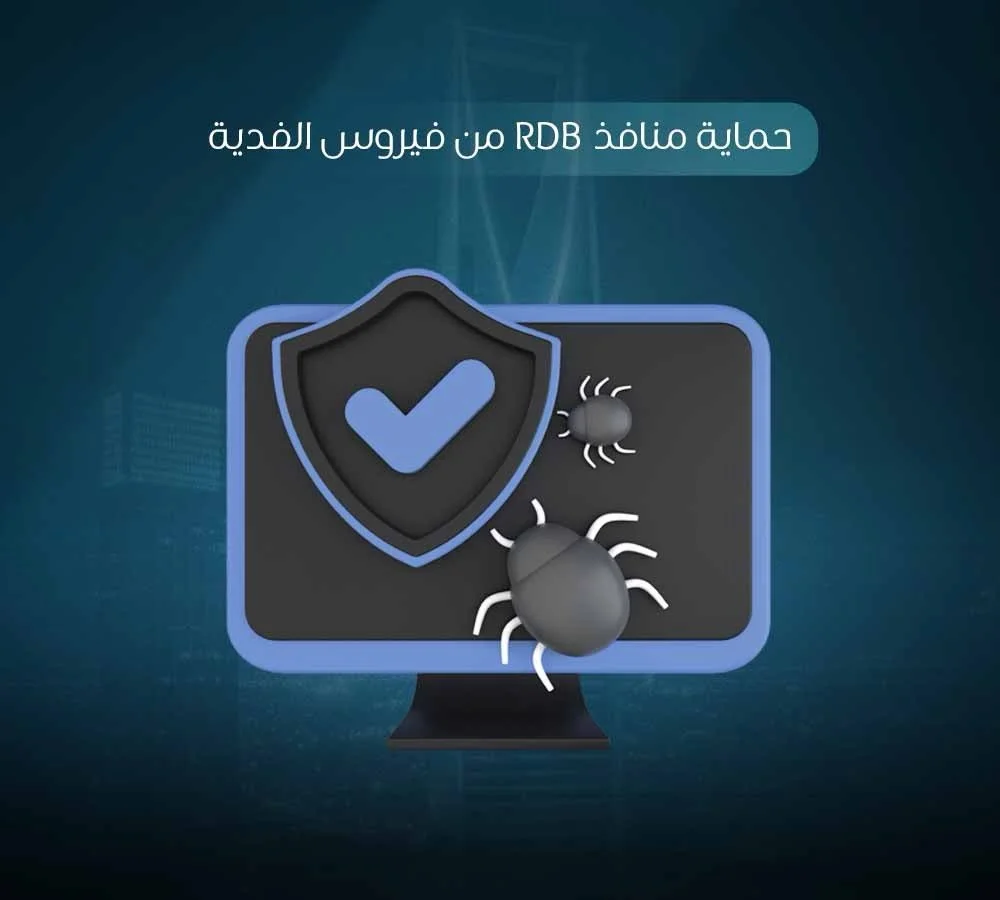

تكلفة الوقاية من الهجمات السيبرانية، والتي تتطلب دقائق وإجراءات بسيطة، تظل دائماً أقل بكثير من تكلفة العلاج بعد الإصابة التي تكبدك أياماً من التوقف، خسارة بيانات حساسة، ومبالغ مالية ضخمة. يقدم هذا الدليل الشامل والموسع خطوات عملية ومباشرة تضمن [الحماية من فيروس الفدية](https://datarecovery-sa.com/blog/ransomware-in-riyadh/) للأفراد والشركات في بيئة الأعمال، مع التركيز بشكل خاص على إغلاق ثغرات الدخول الشائعة مثل منافذ الوصول عن بعد، وتطبيق سياسات أمنية صارمة تضمن أمن المعلومات المؤسسية بالاستعانة باستشارات خبراء[ **من الصفر الى الواحد لاسترجاع البيانات**](https://datarecovery-sa.com/). في عالمنا الرقمي اليوم، لم يعد السؤال هو هل ستتعرض لهجوم سيبراني، بل متى ستتعرض له، ومدى استعدادك للتصدي له قبل أن يطال ملفاتك الحيوية ويدمر أعمالك.

## **الخطوات الأساسية لضمان الحماية من فيروس الفدية**

تشكل هذه الإجراءات خط الدفاع الأول والأساسي الذي يجب على كل مستخدم وشركة تطبيقه فوراً لتجنب الوقوع ضحية للابتزاز الرقمي وتأمين بياناته الشخصية والعملية بشكل قاطع،

- **النسخ الاحتياطي الدوري والمستقل (قاعدة 3،2،1)،** الاحتفاظ بنسخ احتياطية هو الحل السحري الذي يجرد المهاجمين من سلاحهم الوحيد. يجب تطبيق قاعدة النسخ الاحتياطي الذهبية التي تنص على الاحتفاظ بثلاث نسخ من بياناتك، على وسيطين مختلفين للتخزين، مع إبقاء نسخة واحدة على الأقل مفصولة تماماً عن شبكة الإنترنت وعن الجهاز الرئيسي. هذه النسخة المفصولة تسمى (Air-Gapped Backup)، وتضمن أنه في حال وصول الفيروس إلى جهازك وتشفير الملفات المتصلة، ستبقى هذه النسخة آمنة تماماً، مما يتيح لفريق **من الصفر الى الواحد لاسترجاع البيانات** [إعادة أنظمتك للعمل في وقت قياسي.](https://datarecovery-sa.com/blog/data-recovery-services-riyadh/)
- **تحديث نظام التشغيل والبرامج باستمرار،** تعتمد معظم إصابات الفدية على استغلال ثغرات أمنية قديمة ومعروفة تم إصلاحها بالفعل من قبل الشركات المطورة في تحديثات لاحقة. قراصنة الإنترنت يعلمون أن الكثير من المستخدمين يؤجلون التحديثات، فيقومون بتوجيه هجماتهم نحو هذه الأنظمة غير المحدثة. تجاهل تثبيت هذه التحديثات يترك باباً خلفياً مفتوحاً للمخترقين. لذلك، يجب تفعيل ميزة التحديث التلقائي لأنظمة التشغيل، متصفحات الإنترنت، وبرامج قراءة الملفات مثل ملفات الـ PDF التي غالباً ما تُستغل في الهجمات.
- **تثبيت برنامج حماية موثوق وتفعيل الجدار الناري،** تأكد من تفعيل جدار الحماية (Firewall) الأساسي في نظام التشغيل لمنع الاتصالات غير المصرح بها من وإلى جهازك. بالإضافة إلى ذلك، استخدم برامج مكافحة فيروسات متقدمة تدعم تقنيات الكشف السلوكي، والتي لا تعتمد فقط على قاعدة بيانات الفيروسات القديمة، بل قادرة على رصد السلوكيات المشبوهة وعمليات التشفير غير المصرح بها في الوقت الفعلي وإيقافها فوراً.
- **الحذر المطلق من رسائل البريد الإلكتروني المشبوهة،** التصيد الاحتيالي (Phishing) هو البوابة الأولى لدخول برمجيات الفدية. تجنب النقر على أي روابط أو فتح مرفقات قادمة من مصادر مجهولة أو رسائل تبدو مريبة، حتى لو ادعت أنها فواتير، مستندات عمل هامة، أو إشعارات من شركات شحن. تحقق دائماً من عنوان البريد الإلكتروني للمُرسل بدقة، ولا تكتفي بالاسم الظاهر، فالمهاجمون يبرعون في تزييف هويات الشركات الكبرى لخداع الموظفين.
- **تفعيل المصادقة الثنائية (2FA)،** طبّق ميزة التحقق بخطوتين على جميع الحسابات المهمة والبريد الإلكتروني، وتطبيقات العمل السحابية. هذه الخطوة تضيف طبقة أمان قوية جداً تقلل من فرص اختراق بيانات الدخول، فحتى في حال نجح المهاجمون في تسريب أو تخمين كلمات المرور الخاصة بك، لن يتمكنوا من الدخول إلى النظام دون رمز التحقق الإضافي الذي يصل إلى هاتفك الشخصي.

## **كيفية حماية منافذ RDP من فيروس الفدية**

يعتبر بروتوكول سطح المكتب البعيد (RDP) أداة حيوية لمدراء تقنية المعلومات للوصول إلى الأجهزة والخوادم عن بعد لإجراء عمليات الصيانة أو العمل من المنزل، ولكنه يُعد في الوقت ذاته من أكثر نقاط الدخول استغلالاً واستهدافاً من قبل المهاجمين. عندما يُترك هذا المنفذ مفتوحاً للإنترنت بكلمات مرور ضعيفة، تقوم برامج المسح الآلي للمخترقين باكتشافه فوراً. لضمان حماية منافذ RDP من فيروس الفدية بفعالية عالية، يجب على مدراء الأنظمة الالتزام الصارم بالضوابط التقنية التالية،

- **عدم تعريض المنفذ مباشرة للإنترنت العام،** الخطأ التقني الأكبر هو توجيه منفذ RDP الافتراضي مباشرة عبر جهاز التوجيه (Router) ليصبح متاحاً لأي عملية مسح عشوائية على شبكة الإنترنت. يجب إبقاء هذا المنفذ مخفياً تماماً خلف جدار حماية قوي وعدم السماح بالاتصالات الخارجية المباشرة إليه.
- **استخدام شبكة خاصة افتراضية (VPN)،** يُعد الاتصال عبر شبكة افتراضية مشفرة وموثوقة هو البديل الآمن والوحيد للوصول عن بعد. من خلال هذه التقنية، يُجبر المستخدمون على المصادقة وتسجيل الدخول داخل الشبكة الآمنة للشركة أولاً، ومن ثم فقط يمكنهم الوصول إلى الأجهزة الداخلية عبر بروتوكول RDP، مما يعزل الخوادم تماماً عن العالم الخارجي.
- **فرض سياسات كلمات مرور قوية ومعقدة،** التأكد من إجبار جميع المستخدمين الإداريين وموظفي الدعم الفني على وضع كلمات مرور طويلة ومعقدة تتجاوز 12 حرفاً، وتحتوي على رموز وأرقام وحروف متباينة، مع إلزامهم بتغييرها دورياً. والأهم من ذلك، تفعيل خاصية التحقق بخطوتين لجميع حسابات الوصول عن بعد لضمان موثوقية هوية المتصل في كل مرة.
- **تقييد عدد محاولات تسجيل الدخول الفاشلة (Account Lockout Policy)،** تفعيل سياسة إغلاق الحساب مؤقتاً وبشكل تلقائي بعد عدد محدد من المحاولات الفاشلة (مثلاً 5 محاولات). هذا الإجراء البسيط يمنع تماماً هجمات التخمين الآلية (Brute Force Attacks) التي تستخدم برامج مخصصة لتجربة آلاف كلمات المرور في الدقيقة الواحدة لكسر حماية المنفذ.

## **استراتيجيات حماية بيانات الشركة من هجمات الفدية**

تتطلب بيئة الأعمال والشركات الكبرى منظوراً أمنياً أكثر شمولية من مجرد حماية الأجهزة الفردية، نظراً لحجم البيانات المركزية، تعدد الموظفين، وتعقيد البنية التحتية للشبكات. لتحقيق أعلى مستويات حماية بيانات الشركة من هجمات الفدية وتجنب الشلل التشغيلي، يوصي مهندسو وخبراء الأمن السيبراني في **من الصفر الى الواحد لاسترجاع البيانات** بدمج الإجراءات التالية ضمن أسس البنية التحتية للمؤسسة،

- **تقسيم الشبكة الداخلية (Network Segmentation)،** عزل الأقسام والأنظمة الحساسة عن بعضها البعض برمجياً وفيزيائياً. على سبيل المثال، يجب أن تكون شبكة قسم التسويق أو خدمة العملاء منفصلة تماماً عن خوادم المحاسبة وقواعد البيانات الرئيسية. بهذه الطريقة، إذا تعرض جهاز موظف للإصابة، لا ينتشر الفيروس تلقائياً كالنار في الهشيم عبر كامل الشبكة ليصل إلى الخوادم المركزية ويدمرها.
- **تقييد وتخصيص صلاحيات الوصول (Least Privilege)،** تطبيق مبدأ الصلاحيات الأقل بصرامة تامة، والذي يعني منح كل موظف صلاحية الوصول والقراءة أو التعديل للملفات التي يحتاجها فعلياً لأداء مهام عمله اليومية فقط. منح صلاحيات إدارية واسعة لجميع الموظفين هو خطأ فادح يسهل على الفيروس تشفير كامل خوادم الشركة وملفات الشبكة المشتركة بمجرد اختراق حساب موظف واحد فقط.
- **تدريب الموظفين وتوعيتهم دورياً،** مهما كانت الأنظمة الأمنية متطورة، يظل العنصر البشري هو الحلقة الأضعف ونقطة الدخول الأولى في معظم الهجمات الناجحة. يجب إخضاع الموظفين لتدريبات دورية ومستمرة، وإجراء اختبارات محاكاة للتعرف على رسائل التصيد الاحتيالي، أساليب الهندسة الاجتماعية، وطرق الإبلاغ الفوري عن الروابط المشبوهة قبل النقر عليها.
- **إعداد خطة استجابة للحوادث مسبقاً (Incident Response Plan)،** الوقت هو العامل الحاسم عند وقوع الهجوم. يجب تحديد بروتوكول طوارئ مكتوب ومُعتمد يوضح من يجب إبلاغه فوراً، وما هي الخطوات التقنية الأولى التي يجب اتخاذها عند اكتشاف إصابة، ومن هو الفريق المسؤول عن عزل الأجهزة المتضررة. وجود خطة واضحة يمنع التخبط وسوء الإدارة في اللحظات الحرجة التي تلي اكتشاف الفيروس.
- **إجراء تدقيق أمني دوري (Security Audit)،** الاستعانة بجهة خارجية متخصصة لاكتشاف الثغرات الكامنة وتقييم متانة الإجراءات الأمنية المتبعة. إجراء اختبارات الاختراق الأخلاقي يساعد على اكتشاف نقاط الضعف في الشبكة وإغلاقها قبل أن يتم استغلالها من قبل القراصنة.

## **ماذا تفعل إذا شككت أنك مستهدف أو تحت هجوم مبكر؟**

التدخل التقني السريع في الدقائق الأولى قد يحد من حجم الكارثة ويمنع التشفير الشامل لبياناتك. الفيروس لا يشفر كامل القرص في ثانية واحدة، بل يستغرق وقتاً يمتد لدقائق أو ساعات حسب حجم البيانات. هناك علامات مبكرة تثير الشك بوجود هجوم فدية قيد التنفيذ، مثل بطء شديد وغير مبرر في أداء الشبكة أو الجهاز، ظهور برامج أو عمليات غريبة تستهلك موارد المعالج بشكل هائل في الخلفية، اختفاء أو تغير أيقونات الملفات وامتداداتها، ظهور ملفات نصية غريبة على سطح المكتب، أو رصد محاولات تسجيل دخول فاشلة ومتكررة على خوادم الشركة.

عند ملاحظة أي من هذه المؤشرات المريبة، يجب فوراً فصل الجهاز المشتبه به عن الشبكة الداخلية وعن شبكة الإنترنت من خلال نزع كابل الشبكة الفعلي، إطفاء الاتصال اللاسلكي، وفصل أي أقراص صلبة خارجية أو وحدات تخزين USB مرتبطة بالجهاز. تجنب إطفاء الجهاز بالقوة أو إعادة تشغيله، لأن بعض مفاتيح التشفير قد تكون محفوظة في الذاكرة العشوائية ويمكن استخراجها من قبل الخبراء. لا تحاول تشغيل برامج فحص عشوائية قد تتلف الأدلة أو تزيد الضرر وتسرع عملية التشفير. بدلاً من ذلك، تواصل فوراً مع فريق تقني متخصص لإجراء فحص دقيق للنظام وعزل التهديد عبر مختبرات وخبراء **من الصفر الى الواحد لاسترجاع البيانات**.

## **الأسئلة الشائعة (FAQ)**

### **ما هي أهم خطوة للحماية من فيروس الفدية؟**

النسخ الاحتياطي الدوري والمفصول تماماً عن الجهاز الرئيسي وعن الشبكة هو الأهم على الإطلاق، لأنه الإجراء الوحيد الذي يبطل تأثير الفدية بالكامل. إذا شُفّرت ملفاتك بالكامل، يمكنك ببساطة تهيئة الجهاز بالكامل واستعادة البيانات من النسخة الاحتياطية بأمان، دون الحاجة للرضوخ للابتزاز ودفع أي مبلغ مالي للمهاجمين المجهولين.

### **لماذا تعتبر منافذ RDP خطيرة جداً وكيف أحميها؟**

منفذ RDP يسمح بالوصول والتحكم الكامل عن بعد بالجهاز وكأنك تجلس أمامه. إذا تُرك هذا المنفذ مفتوحاً مباشرة على الإنترنت بكلمة مرور ضعيفة، يصبح باباً سهلاً ومشرعاً للمهاجمين للسيطرة على الخادم. الحل الأمثل لتأمين وحماية منافذ RDP من فيروس الفدية يتمثل في عدم تعريضه مباشرة للإنترنت بأي شكل، واستخدام اتصال شبكة افتراضية خاصة (VPN) للوصول المشفر، مع فرض سياسات كلمات مرور معقدة.

### **هل النسخ الاحتياطي وحده كافٍ للحماية من فيروسات الفدية؟**

النسخ الاحتياطي هو خط الدفاع الأخير والأهم، لكنه ليس كافياً وحده لمنع الاختراق بشكل قطعي وتجنب أسلوب الابتزاز المزدوج حيث يهدد المهاجم بنشر البيانات وليس فقط تشفيرها. لذلك، يجب أن يترافق النسخ الاحتياطي مع تحديثات النظام المستمرة، تثبيت برنامج حماية موثوق، والحذر الشديد من الروابط والمرفقات المشبوهة لتقليل احتمال الإصابة من الأساس.

### **كيف تحمي الشركات بياناتها من هجمات الفدية تحديداً؟**

يتم ضمان حماية بيانات الشركة من هجمات الفدية بشكل فعال عبر تقسيم الشبكة الداخلية وعزل الخوادم الحساسة، تقييد صلاحيات الوصول للملفات حسب الحاجة الفعلية للموظف، تدريب طاقم العمل بانتظام لرفع الوعي الأمني، وإعداد خطة استجابة واضحة للحوادث بتوجيه مباشر من استشاريي وخبراء **من الصفر الى الواحد لاسترجاع البيانات** المتمرسين.

### **هل برامج مكافحة الفيروسات كافية وحدها للحماية الكاملة؟**

لا، برنامج الحماية يمثل طبقة أمنية واحدة فقط ضمن استراتيجية دفاعية شاملة. المهاجمون يطورون الفيروسات يومياً لتجاوز برامج الحماية، لذا يجب أن تشمل الاستراتيجية التحديثات المستمرة للأنظمة، خطط النسخ الاحتياطي الفعال المعزول عن الشبكة، والوعي الأمني للمستخدمين. لا يوجد حل تقني واحد يضمن حماية كاملة ومطلقة بمفرده دون تكامل باقي العناصر.

### **ما الذي يجب فعله فور الشك بمحاولة اختراق عبر فدية؟**

افصل الجهاز المشتبه به عن الشبكة السلكية واللاسلكية فوراً لمنع انتشار الفيروس إلى الأجهزة والخوادم الأخرى، ولا تحاول حذف الملفات، تعديل الامتدادات، أو استعادة أي شيء بنفسك لتجنب إتلاف البيانات نهائياً. تأكد من وضع أجهزتك المتضررة في أيدٍ أمينة وخبيرة، **تواصل مع خبراء من الصفر الى الواحد لاسترجاع البيانات** لتقييم الوضع الفني المعقد والتدخل الفوري قبل تفاقم المشكلة وفقدان البيانات للأبد.

## **الخاتمة**

الحماية من الفيروسات والبرمجيات الخبيثة ليست مجرد منتج برمجي تشتريه وتنساه، بل هي ثقافة مؤسسية ومجموعة عادات وإجراءات أمنية بسيطة ومستمرة تتطلب اليقظة الإدارية والتقنية المطلقة من كافة أفراد الشركة. تأمين شبكاتك وبياناتك اليوم بالاعتماد على أسس علمية وقائية يوفر عليك خسائر مالية فادحة، وانهياراً للعمليات التشغيلية، ودماراً لسمعة مؤسستك غداً. لضمان سلامة أصولك الرقمية وتأمين خوادمك من هذه التهديدات المتصاعدة، بادر الآن بتطبيق سياسات النسخ الاحتياطي الصارمة، واطلب تدقيقاً أمنياً مبدئياً لشركتك. وإذا وقعت الكارثة، أو واجهت أي تهديد حقيقي لاختراق ملفاتك وأنظمتك، لا تتردد لحظة واحدة، [**تواصل مع خبراء من الصفر الى الواحد لاسترجاع البيانات**](https://datarecovery-sa.com/contact.html) فوراً لضمان احتواء الأزمة، تقديم الدعم الفني المتقدم، وعودة أعمالك للحياة بأمان تام وبأقل الخسائر الممكنة.
