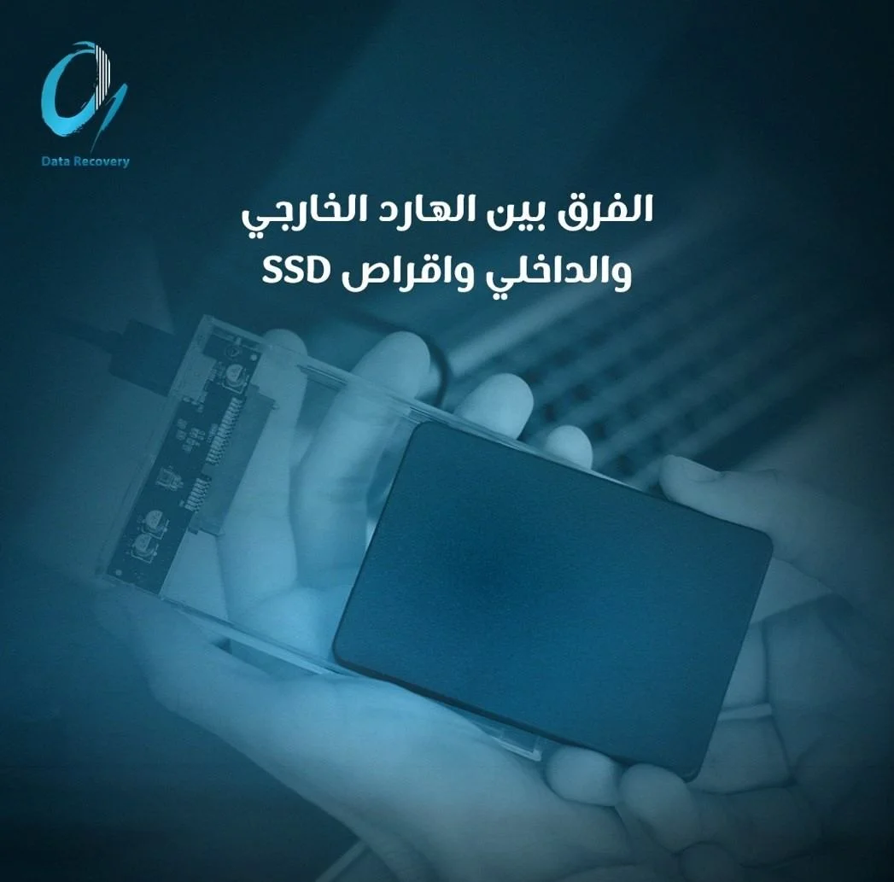
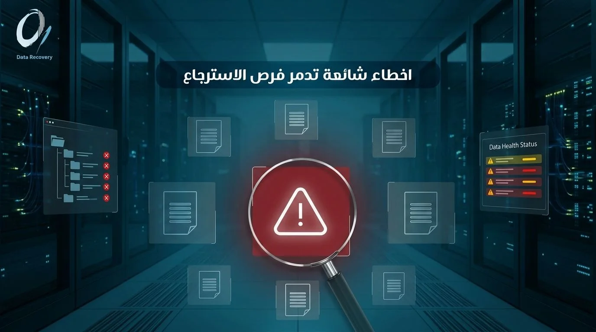

## **استرجاع البيانات من الهارد ديسك التالف**

قاعدة ذهبية مهدئة، التلف لا يعني دائماً ضياع البيانات للأبد. عندما يتوقف جهازك عن العمل فجأة، أو تسمع صوتاً غريباً يصدر من القرص الصلب، فإن الشعور بالذعر هو أول ما يتبادر إلى الذهن. صور العائلة، ملفات العمل الحساسة، وقواعد بيانات العملاء، كلها تبدو وكأنها ضاعت في لحظة واحدة. لكن الحقيقة التقنية تؤكد أن البيانات في معظم حالات التلف تبقى موجودة على الأقراص الداخلية، والمشكلة تكمن فقط في قدرة النظام على الوصول إليها وقراءتها.

## **أهمية التوقف الفوري عن استخدام القرص الصلب عند أول علامة للخلل**

الخطأ الأكبر الذي يقع فيه المستخدمون عند مواجهة مشكلة في القرص الصلب هو المحاولة المتكررة لإعادة تشغيله. يجب عليك التوقف فوراً عن استخدام القرص الصلب عند شعورك بأي خلل، لأن الاستمرار في تشغيله قد يدمر البيانات بشكل نهائي عبر ما يُعرف بالكتابة الفوقية (Overwriting).

عندما تفقد القدرة على الوصول إلى ملفاتك بسبب تلف منطقي، فإن نظام التشغيل لا يحذف البيانات فعلياً، بل يقوم بتمييز المساحة التي تشغلها هذه الملفات على أنها مساحة فارغة ومتاحة للاستخدام. إذا استمررت في تشغيل الجهاز، أو تصفح الإنترنت، أو تحميل برامج جديدة لمحاولة الفحص، فإن النظام قد يكتب هذه البيانات الجديدة فوق ملفاتك القديمة المخفية. بمجرد حدوث الكتابة الفوقية، تصبح [عملية استرجاع البيانات](https://datarecovery-sa.com/blog/data-recovery-services-riyadh/) من القرص الصلب التالف شبه مستحيلة حتى على أعتى المختبرات. إضافة إلى ذلك، إذا كان التلف ميكانيكياً، فإن دوران الأقراص الداخلية واحتكاك الرأس القارئ بها سيؤدي إلى خدش الأسطوانات المغناطيسية، مما يمحو البيانات فعلياً إلى الأبد.

## **تصنيف الأقراص: الفارق بين القرص الصلب الخارجي والداخلي وأقراص SSD**

من الضروري جداً أن نصنف بوضوح الفارق بين القرص الصلب الخارجي (External)، والقرص الصلب الداخلي (Internal)، وأقراص SSD الحديثة، لأن آلية التلف والاسترجاع تختلف بينها تماماً، والتعامل مع كل نوع يتطلب منهجية تقنية مختلفة كلياً:

### **القرص الصلب الداخلي (Internal Hard Drive)**

هو القرص الميكانيكي التقليدي المثبت داخل أجهزة الكمبيوتر المكتبية والمحمولة. يتكون من أقراص ممغنطة تدور بسرعات عالية، ورأس قارئ يتحرك فوقها بأجزاء من المليمتر. التلف هنا غالباً ما يكون إما في اللوحة الإلكترونية أو في الأجزاء الحركية الداخلية. عملية استرجاع البيانات من القرص الصلب التالف داخلياً تتطلب حذراً شديداً، وفي حالات التلف الميكانيكي، لابد من تدخل خبراء **من الصفر الى الواحد** لفتح القرص داخل غرف نظيفة (Clean Rooms) خالية تماماً من ذرات الغبار التي قد تدمر الأسطوانات المكشوفة.

### **القرص الصلب الخارجي (External Hard Drive)**

رغم أنه يحمل نفس التكنولوجيا الميكانيكية غالباً، إلا أن القرص الصلب الخارجي يمتلك طبقة إضافية وهي دائرة التحويل التي تحول المخرج الداخلي إلى منفذ USB، بالإضافة إلى الغلاف البلاستيكي أو المعدني. كيفية استرجاع الملفات من قرص صلب خارجي تالف قد تكون أسهل في بعض الأحيان، لأن المشكلة قد لا تكون في القرص نفسه، بل في منفذ التوصيل التالف، أو الكابل المهترئ، أو دائرة التحويل التي تعرضت لصدمة كهربائية. في هذه الحالات، يقوم مهندسو **من الصفر الى الواحد** بتجاوز الغلاف الخارجي وتوصيل القرص الداخلي مباشرة لإنقاذ البيانات دون المساس بالأسطوانات.

### **أقراص الحالة الصلبة الحديثة (SSD)**

هذه الأقراص لا تحتوي على أي أجزاء ميكانيكية متحركة، بل تعتمد على رقاقات ذاكرة ووحدة تحكم. هذا يعني أنها لا تصدر أي أصوات طقطقة عند تلفها. التلف هنا يكون فجائياً وصامتاً، وغالباً ما ينتج عن نفاد عمر دورات الكتابة والقراءة، أو تلف إلكتروني بسبب تذبذب التيار. استرجاع البيانات من أقراص SSD يعتبر تحدياً معقداً جداً بسبب خواص المسح التلقائي التي تقوم بإزالة البيانات المحذوفة نهائياً لتسريع أداء القرص. لذلك، التدخل السريع من قبل فريق **من الصفر الى الواحد** هو الأمل الوحيد لإنقاذ الملفات قبل أن تقوم وحدة التحكم بتدميرها برمجياً.

## **كيف تعرف أن القرص الصلب تالف فعلياً؟**

للتعرف على حالة القرص وتحديد الخطوة التالية، يجب الانتباه إلى هذه الأعراض الشائعة:

1. **أصوات النقر والطقطقة:** وهي العلامة الأبرز لتلف القرص الصلب الميكانيكي، وتعني أن الرأس القارئ يضرب بقوة في أطراف الأسطوانة ولا يستطيع قراءة البيانات.
2. **اختفاء القرص من النظام:** تقوم بتوصيل القرص الصلب، وتسمع صوت دورانه، لكنه لا يظهر في نظام التشغيل إطلاقاً، ولا يمكنك الوصول لأي قسم منه.
3. **بطء النظام الشديد والتجمد:** عندما يحاول النظام قراءة قطاعات تالفة، فإنه يدخل في حلقة لا نهائية من المحاولات، مما يسبب تجمداً كاملاً لجهاز الكمبيوتر.
4. **رسائل طلب التهيئة (Format):** ظهور رسالة تخبرك بأن القرص بحاجة إلى تهيئة قبل استخدامه. هذه المشكلة غالباً منطقية، والموافقة على التهيئة هي أسوأ قرار يمكنك اتخاذه.

## **هل يمكن إصلاح القرص الصلب التالف ليعود للعمل؟**

هناك لبس كبير بين إصلاح القرص الصلب التالف وبين عملية استرجاع البيانات منه. إذا كان القرص يعاني من تلف ميكانيكي، فإن الهدف الحقيقي والوحيد هو استرجاع ملفات من قرص صلب تالف، وليس إعادته للعمل كقرص تخزين تعتمد عليه لاحقاً. بعد فتح القرص وتغيير أجزائه لإنقاذ البيانات، يفقد القرص موثوقيته تماماً ويصبح غير صالح للاستخدام اليومي. أما في حالات التلف المنطقي البسيط، مثل أخطاء نظام الملفات، فيمكن أحياناً إصلاح الخلل برمجياً ليعود القرص للعمل، لكن القاعدة الذهبية تنص على ضرورة استخراج البيانات وحفظها في مكان آمن أولاً قبل أي محاولة إصلاح لتجنب الكوارث.

## **أخطاء شائعة تدمر فرص الاسترجاع تماماً**

لكي تحافظ على أعلى نسبة نجاح في إنقاذ ملفاتك، تجنب هذه الممارسات المدمرة:

1. **الفحص عبر برامج الصيانة العشوائية:** تشغيل برامج فحص الأقراص على قرص صلب يعاني من تلف فيزيائي سيؤدي إلى إرهاق القرص ومحاولة الكتابة فوق القطاعات التالفة، مما يدمر البيانات بشكل لا رجعة فيه.
2. **الاعتماد على برامج استرجاع مجانية في حالات التلف الميكانيكي:** هذه البرامج مخصصة للملفات المحذوفة من أقراص سليمة، واستخدامها لمحاولة استرجاع البيانات من قرص صلب تالف ميكانيكياً يضاعف من الخدوش على الأسطوانات.
3. **الخرافات المنتشرة على الإنترنت:** مثل وضع القرص الصلب في التبريد أو ضربه بخفة. هذه الممارسات تؤدي إلى تكثف الرطوبة داخل القرص وتدمير الأسطوانات المغناطيسية نهائياً.
4. **فتح الغطاء في المنزل:** أي ذرة غبار تسقط على أسطوانات القرص الصلب ستتحول إلى أداة خدش مدمرة عند دوران القرص بسرعات عالية.

## **متى تحتاج إلى شركة متخصصة لاسترجاع بياناتك؟**

إذا كانت ملفاتك المفقودة عبارة عن برامج يمكن إعادة تحميلها، فقد تتحمل رفاهية التجربة الذاتية. لكن، عندما نتحدث عن ذكريات عائلية لا تقدر بثمن، أو ملفات محاسبية للشركة، أو مشاريع تخرج، فإن المحاولات الفردية تعتبر مقامرة خطيرة جداً. في حالات عدم التعرف على القرص، أو صدور أصوات غريبة، أو تعرض الأقراص الحديثة للتهيئة، فإن اللجوء لخبرات **من الصفر الى الواحد** هو الحل الأوحد. يمتلك خبراؤنا غرفاً نظيفة متوافقة مع المعايير العالمية، وأجهزة وتقنيات متقدمة قادرة على قراءة البيانات من الأقراص المتضررة وتخطي القطاعات التالفة دون إرهاق الأجزاء الميكانيكية.

## **الأسئلة الشائعة (FAQ)**

### **هل يمكن استرجاع البيانات من قرص صلب لا يعمل نهائياً ولا يصدر أي صوت؟**

نعم بالتأكيد، عندما لا يصدر القرص أي صوت ولا يدور، فإن المشكلة غالباً تكون في اللوحة الإلكترونية التي تعرضت لاحتراق نتيجة تماس كهربائي. يمكن لخبراء **من الصفر الى الواحد** استبدال هذه اللوحة بقطعة مطابقة ونقل الرقاقة الأساسية، مما يعيد الحياة للقرص لفترة كافية لاستخراج كافة البيانات بنجاح.

### **ما الفرق الفعلي بين إصلاح القرص الصلب واسترجاع البيانات منه؟**

الإصلاح يهدف إلى جعل القرص قابلاً لإعادة الاستخدام وحفظ الملفات الجديدة عليه، وهو أمر غير ممكن أو آمن في حالات التلف الميكانيكي. بينما استرجاع البيانات يركز فقط على إنقاذ الملفات الموجودة داخل القرص التالف باستخدام تقنيات متخصصة، ثم نقل هذه الملفات إلى قرص جديد تماماً وتسليمه للعميل.

### **هل يُعامل القرص الصلب الخارجي التالف بنفس طريقة القرص الداخلي تماماً؟**

مبدأ الاسترجاع متقارب، لكن الأقراص الخارجية تتطلب خطوة أولية وهي فحص دائرة التوصيل الخارجية. في كثير من الأحيان، تكون الصدمة أو الخلل محصوراً في منفذ التوصيل الخارجي، ويقوم فريق **من الصفر الى الواحد** بتخطي هذه الدائرة واستخراج البيانات مباشرة من القرص الداخلي.

### **ما علامات تلف القرص الصلب الميكانيكي تحديداً؟**

العلامات الميكانيكية واضحة ولا تخطئها الأذن، وأبرزها سماع صوت طقطقة أو صرير متكرر عند إيصال القرص بالكهرباء. بالإضافة إلى ذلك، قد يصدر القرص طنيناً خافتاً جداً مع عدم قدرة المحرك على الدوران، وفي جميع هذه الحالات يختفي القرص تماماً من واجهة نظام التشغيل.

### **هل تشغيل القرص الصلب التالف بشكل متكرر يزيد الضرر فعلاً أم أنها مجرد مبالغة؟**

إنها حقيقة علمية وليست مبالغة، فعند سماع صوت طقطقة، فإن الرأس القارئ الحاد جداً يحتك بشكل مباشر بالأسطوانات المغناطيسية التي تدور بآلاف اللفات في الدقيقة. كل ثانية إضافية من التشغيل تقوم بحفر طبقة البيانات المغناطيسية وتدميرها، مما يجعل عملية الاسترجاع مستحيلة.

### **كم تستغرق عملية استرجاع البيانات من القرص الصلب التالف؟**

يعتمد الوقت المستغرق بشكل رئيسي على نوع التلف ومساحة القرص. الأعطال المنطقية المعقدة قد تستغرق يوماً إلى ثلاثة أيام. أما الحالات الميكانيكية التي تتطلب البحث عن قطع غيار متطابقة، وفتح القرص في الغرفة النظيفة عبر خبراء [**من الصفر الى الواحد**](https://datarecovery-sa.com/)، فقد تتطلب وقتاً أطول لضمان استخراج البيانات بأمان تام.

التصرف الحكيم والسريع هو ما يفصل بين استعادة بياناتك كاملة وبين فقدانها للأبد. لا تترك مصير ملفاتك للصدفة، وتجنب التجارب العشوائية التي تفاقم المشكلة وتزيد من تكلفة الإنقاذ. لضمان حماية أصولك الرقمية واستعادتها بأعلى معايير السرية والموثوقية،[ **تواصل مع خبراء من الصفر الى الواحد لاسترجاع البيانات**](https://datarecovery-sa.com/contact.html) اليوم، واطلب استشارة وفحصاً مبدئياً لتقييم حالة قرصك التالف بدقة.
