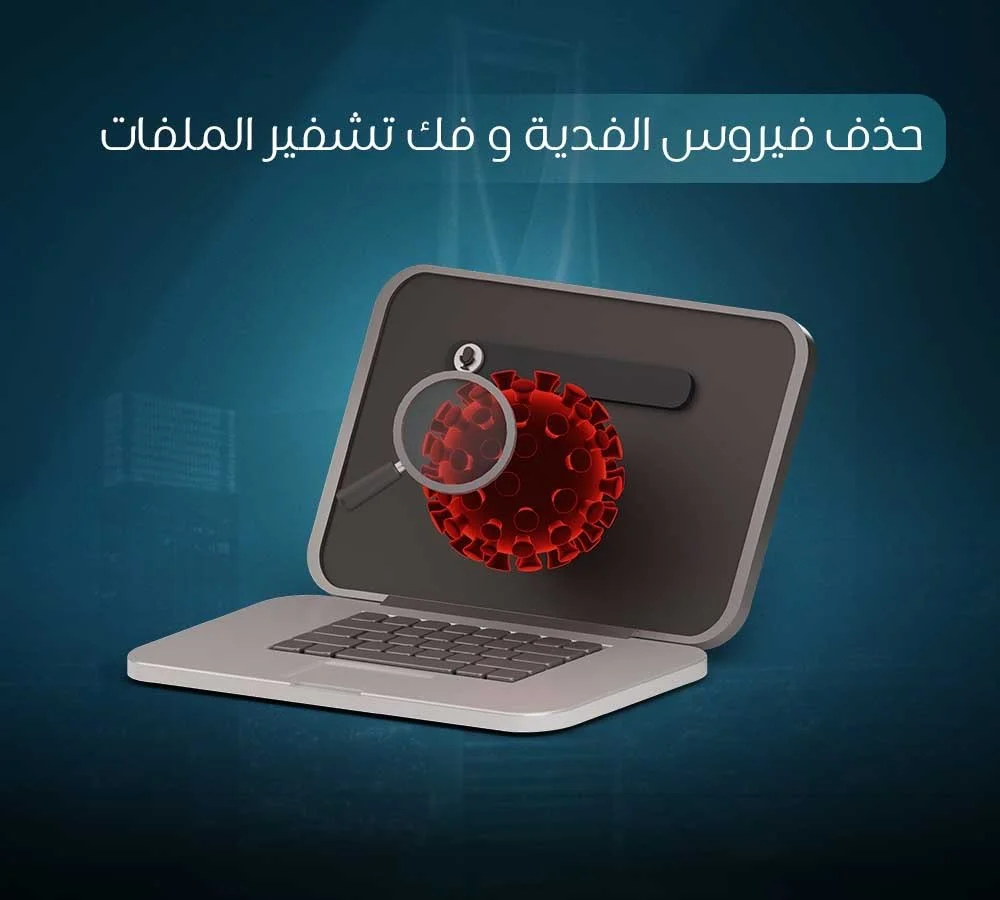
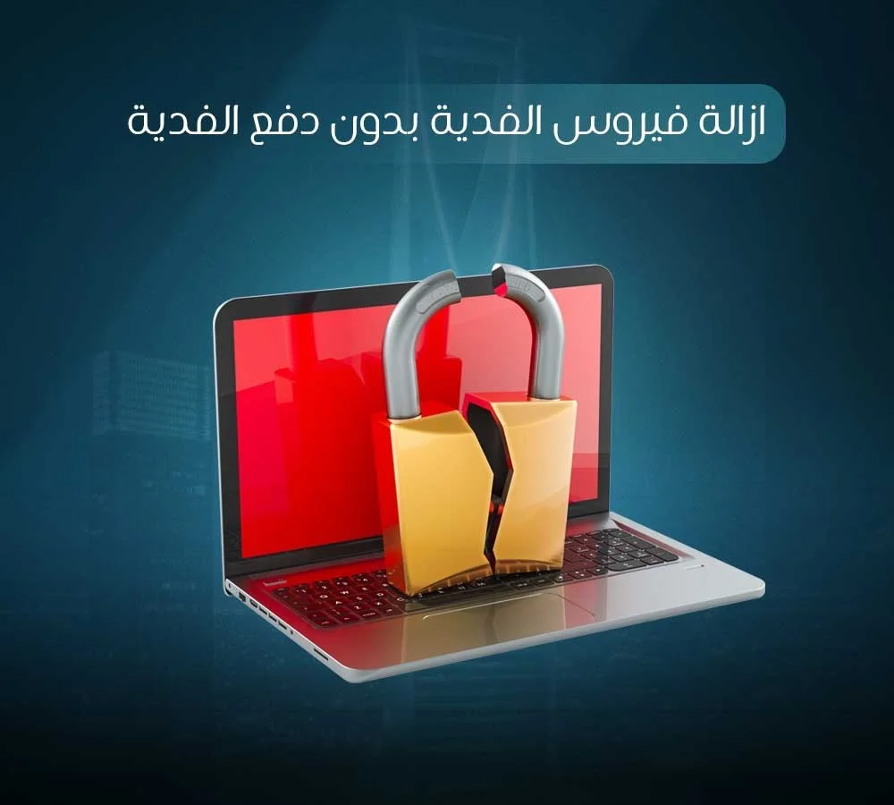

## **كيفية إزالة فيروس الفدية والقضاء عليه نهائياً**

تخيل أن تفتح جهاز الكومبيوتر الخاص بك في بداية يوم عمل هام، لتجد أن جميع ملفاتك قد تحولت إلى رموز غير مفهومة، وتتوسط الشاشة رسالة فدية تهديدية تطالبك بدفع مبالغ طائلة بالعملات الرقمية لاستعادة حياتك الرقمية. إنه موقف يبعث على الذعر الحقيقي، لكن خذ نفساً عميقاً، فنحن هنا لنرشدك. الخبر السار والمؤكد هو أن عملية إزالة [فيروس الفدية ](https://datarecovery-sa.com/blog/ransomware-in-riyadh/)بحد ذاتها ممكنة دائماً تقريباً، ويمكنك القيام بها وتنظيف نظامك بالكامل دون دفع أي مبلغ للمبتزين. لكن، من الضروري جداً أن ننبهك بلطف وموضوعية إلى أن تنظيف الجهاز من البرنامج الخبيث هو خطوة، واسترجاع الملفات المشفرة هي مسألة أخرى منفصلة تماماً سيتم توضيحها بالتفصيل في هذا الدليل، لكي تتخذ قراراتك بناءً على وعي تقني كامل بمساعدة خبراء **من الصفر الى الواحد لاسترجاع البيانات**.

## **نقطة مهمة قبل البدء، الفرق بين إزالة الفيروس وفك تشفير الملفات**

يقع الكثير من المستخدمين في فخ الخلط بين مصطلحين تقنيين مختلفين تماماً، مما يؤدي إلى اتخاذ قرارات خاطئة قد تدمر البيانات للأبد. يجب أن نوضح بوضوح تام، إزالة فيروس الفدية تعني التخلص من البرنامج الخبيث نفسه من الجهاز حتى يتوقف عن العمل، ويتوقف عن تشفير المزيد من الملفات، ويُمنع من الانتشار عبر الشبكة، وهذا الإجراء التقني ممكن دائماً تقريباً.

أما فك تشفير الملفات فهو أمر مختلف تماماً وأكثر تعقيداً. فك التشفير يعني فك الرموز المعقدة التي أغلق بها الفيروس ملفاتك لتعود إلى طبيعتها، وهذا يعتمد حصرياً على نوع الفيروس المحدد، وتوفر أداة فك تشفير معروفة له أطلقها باحثو الأمن السيبراني، أو وجود نسخة احتياطية سليمة لديك، وقد لا يكون فك التشفير ممكناً بشكل فوري في كل الحالات.

لذلك، يجب التأكيد على أن [حذف فيروس الفدية](https://datarecovery-sa.com/ransomware/) وفك تشفير الملفات هما مرحلتان متتاليتان. حذف الفيروس أولاً هو خطوة حتمية وضرورية على أي حال، سواء أمكن فك التشفير لاحقاً أم لا، لأن بقاء الفيروس نشطاً في الخلفية يعني أن أي ملف جديد ستقوم بإنشائه، أو أي قرص صلب خارجي ستقوم بتوصيله، سيتم تشفيره فوراً، ناهيك عن خطر انتقال العدوى لأجهزة زملائك في العمل، وهنا يبرز دور التدخل الاحترافي من قبل **من الصفر الى الواحد لاسترجاع البيانات** لضمان سلامة بيئة العمل.

## **خطوات إزالة فيروس الفدية من الجهاز خطوة بخطوة**

التصرف بهدوء وبطريقة منهجية في الدقائق الأولى هو مفتاح النجاة. اتبع هذه الخطوات التقنية الدقيقة لضمان عزل التهديد وإزالته بأمان،

1. **العزل الفوري للشبكة والأجهزة،** بمجرد رؤية رسالة الفدية، افصل الجهاز عن شبكة الإنترنت فوراً. انزع كابل الشبكة السلكية، وأوقف تشغيل الاتصال اللاسلكي. علاوة على ذلك، افصل أي أقراص تخزين خارجية، وحدات ذاكرة، أو خوادم سحابية متصلة بالجهاز. هذا العزل الفوري يمنع الفيروس من التواصل مع خوادم المهاجمين ويوقف زحفه نحو باقي أجهزة الشبكة.
2. **توثيق الحالة وجمع الأدلة،** قبل البدء بأي خطوة تنظيف، استخدم كاميرا هاتفك المحمول لتصوير رسالة الفدية الظاهرة على الشاشة بوضوح. لاحظ ودوّن امتداد الملفات المشفرة الجديد، حيث تتحول الملفات إلى صيغ غريبة. هذه التفاصيل الدقيقة هي ما يساعد خبراء **من الصفر الى الواحد لاسترجاع البيانات** لاحقاً على تحديد عائلة الفيروس بدقة والبحث عن حلول مخصصة لفك التشفير.
3. **الدخول بالوضع الآمن،** أعد تشغيل جهاز الكومبيوتر وادخل إلى الوضع الآمن مع دعم الشبكة. هذه الخطوة الجوهرية تمنع نظام التشغيل من تحميل أي برامج غير أساسية عند بدء التشغيل، مما يقلل بشكل كبير من نشاط البرامج الخبيثة ويمنع الفيروس من حماية نفسه أو عرقلة عملية التنظيف.
4. **الفحص الشامل والإزالة،** بينما أنت في الوضع الآمن، استخدم برنامج حماية موثوق ومحدّث إلى آخر إصدار. قم بإجراء فحص شامل وعميق لجميع الأقراص الصلبة في الجهاز. ستقوم أداة الحماية باكتشاف الملفات التنفيذية الخبيثة المرتبطة بفيروس الفدية، وعزلها، ثم إزالتها بالكامل من جذور النظام.
5. **التحقق من عدم بقاء أي أثر،** لا تكتفِ بفحص واحد. يُنصح بإعادة فحص الجهاز باستخدام أداة مكافحة برمجيات خبيثة أخرى كطرف ثانٍ للتأكد من نظافة سجلات النظام والملفات المخفية. التحقق المزدوج يضمن عدم وجود أي برامج خبيثة متبقية تنتظر إعادة تنشيط نفسها قبل إعادة توصيل الجهاز بالشبكة المحلية.

## **هل يمكن إزالة فيروس الفدية بدون دفع الفدية؟**

هذا هو السؤال الذي يدور في ذهن كل ضحية، والإجابة القاطعة هي نعم. إن عملية إزالة فيروس الفدية بدون دفع الفدية هي الإجراء القياسي والممكن دائماً، حيث أن إزالة البرنامج الخبيث نفسه من نظام التشغيل لا تحتاج أبداً لدفع أي مبلغ مالي للمهاجمين. الدفع مرتبط حصرياً بمحاولة الحصول على مفتاح فك التشفير السري، وهو أمر منفصل تماماً عن تنظيف الجهاز.

يجب أن تدرك أن دفع الفدية يحمل مخاطر إضافية فادحة، فلا يوجد أي ضمان قانوني أو أخلاقي بأن المجرمين سيرسلون لك مفتاح فك التشفير الفعلي بعد استلام الأموال. في كثير من الحالات، يستلم المهاجمون العملات الرقمية ويختفون تماماً. بالإضافة إلى ذلك، رضوخك للدفع يمول هذه العصابات الإجرامية، ويضع علامتك التجارية في قائمة الأهداف السهلة، مما يُعرّضك لاستهداف متكرر مستقبلاً.

## **القضاء على فيروس الفدية نهائياً، كيف تتأكد أنه لن يعود؟**

تنظيف الجهاز هو نصف المعركة، لكن لضمان القضاء على فيروس الفدية بشكل نهائي ومنع تكرار الكارثة، يجب عليك اتخاذ تدابير أمنية صارمة ومباشرة بعد عملية الإزالة

### **تغيير جميع كلمات المرور الحساسة:**

بعد التأكد التام من نظافة الجهاز، سارع بتغيير جميع كلمات المرور الخاصة بك، خصوصاً إذا كان الجهاز متصلاً بحسابات حساسة مثل البريد الإلكتروني للشركة، الحسابات البنكية، أو بوابات الدفع.

### **تحديث نظام التشغيل والتطبيقات:**

الفيروس لم يدخل إلى جهازك صدفة، بل استغل ثغرة أمنية موجودة. حدّث نظام التشغيل وجميع البرامج المثبتة، متصفحات الإنترنت، وإضافات النظام فور انتهاء التنظيف لسد أي ثغرة استُغلت للدخول في المرة الأولى.

### **المراقبة الحذرة والمستمرة:**

راقب أداء الجهاز عن كثب لعدة أيام بعد التنظيف. انتبه لأي نشاط غريب، مثل بطء غير مبرر في الاستجابة، استهلاك عالٍ لموارد المعالج، أو محاولات اتصال مريبة بالإنترنت.

## **أخطاء شائعة عند محاولة إزالة فيروس الفدية بنفسك**

في غمرة القلق والضغط النفسي، يرتكب المستخدمون أخطاءً قاتلة قد تدمر أي فرصة لاستعادة بياناتهم الثمينة، تجنب هذه الممارسات تماماً،

- **حذف الملفات المشفرة،** لا تحذف أبداً الملفات التي تم تشفيرها معتقداً أنها أصبحت تالفة أو عديمة الفائدة. احتفظ بها في مجلد منعزل، فهي قد تكون قابلة لفك التشفير لاحقاً عند اكتشاف ثغرة في خوارزمية الفيروس.
- **تنسيق الجهاز بشكل متسرع،** لا تقم بتهيئة القرص الصلب أو عمل فورمات للجهاز مباشرة قبل محاولة تحديد نوع الفيروس. الفورمات يمحو الفيروس، لكنه يمحو أيضاً أي فرصة لاسترجاع الملفات عبر خبراء **من الصفر الى الواحد لاسترجاع البيانات**.
- **التفاوض المباشر مع المهاجمين،** لا تتفاوض أو تتواصل مع المهاجمين مباشرة بنفسك عبر البريد المرفق في رسالة الفدية دون استشارة فريق أمني متخصص.

## **متى تحتاج مساعدة متخصصة بدلاً من المحاولة الذاتية؟**

إذا كانت الإصابة محدودة بجهاز شخصي لا يحتوي على بيانات هامة، فقد تكون المحاولات الذاتية كافية لتنظيف الجهاز عبر برامج الحماية. ولكن، إذا كانت البيانات المشفرة مهمة جداً وتمثل عصب العمل، مثل بيانات شركة، قواعد بيانات محاسبية، أو ملفات عمل حساسة تراكمت لسنوات، فالمجازفة هنا غير مقبولة إطلاقاً.

في هذه الحالات الحرجة، يُفضّل بل ويجب التواصل مع جهة متخصصة مثل **من الصفر الى الواحد لاسترجاع البيانات** فور اكتشاف الإصابة، وقبل اتخاذ أي خطوة برمجية قد تقلل فرص استرجاع الملفات لاحقاً. تعتمد آلية عملنا على تحليل الهندسة العكسية للفيروس، عزل البيئة المصابة بشكل آمن، والبحث المعمق عن أي ثغرات لإنقاذ ما يمكن إنقاذه بأعلى نسب النجاح الممكنة تقنياً.

## **الأسئلة الشائعة (FAQ)**

### **هل يمكن إزالة فيروس الفدية بدون دفع الفدية؟**

نعم، إزالة الفيروس نفسه من الجهاز وتنظيف النظام لا تحتاج أبداً لدفع أي مبلغ. الدفع مرتبط فقط بمحاولة الحصول على مفتاح فك تشفير الملفات من المهاجمين، وهو أمر منفصل تماماً، وغير مضمون النتيجة إطلاقاً.

### **هل إزالة الفيروس تعني استرجاع ملفاتي المشفرة تلقائياً؟**

لا، إزالة الفيروس توقف نشاطه الخبيث في الخلفية وتمنع تكرار التشفير أو انتشاره لأجهزة أخرى في الشبكة، لكنها لا تفك تشفير الملفات المتضررة بالفعل تلقائياً. عملية فك التشفير تحتاج إلى تدخل متخصص من **من الصفر الى الواحد لاسترجاع البيانات**.

### **كيف أتأكد أن فيروس الفدية أُزيل نهائياً ولن يعود؟**

بعد فحص الجهاز بشكل عميق وإزالة الملفات الخبيثة عبر [برامج الحماية](https://datarecovery-sa.com/blog/ransomware-protection-guide/)، يجب عليك فوراً تغيير جميع كلمات المرور المهمة، تحديث نظام التشغيل وكافة البرامج لسد الثغرات، ومراقبة أداء الجهاز لعدة أيام للتأكد من عدم ظهور أي نشاط غريب.

### **هل تنسيق الجهاز يضمن القضاء على الفيروس؟**

نعم، غالباً يزيل الفورمات وتهيئة القرص الصلب الفيروس بشكل كامل من الجذور، لكنه للأسف يمحو أيضاً أي فرصة تقنية لاسترجاع أو فك تشفير الملفات المتضررة لاحقاً، لذا يُفضّل بشدة عدم اللجوء للفورمات كخطوة أولى.

### **هل يمكنني إزالة فيروس الفدية بنفسي بدون خبرة تقنية؟**

في الحالات الفردية البسيطة نعم، يمكن ذلك عبر استخدام برنامج حماية موثوق والدخول بالوضع الآمن لتنظيف الجهاز. لكن في الحالات المعقدة، يُفضّل الاستعانة بفريق متخصص مثل خبراء **من الصفر الى الواحد لاسترجاع البيانات** لتفادي أي خطأ قد يُصعّب مسار الاسترجاع.

### **ماذا أفعل بالملفات المشفرة بعد إزالة الفيروس؟**

القاعدة الذهبية هي أن تحتفظ بها كما هي ولا تحذفها أبداً. انقلها إلى قرص تخزين خارجي معزول، ويُفضّل عرضها على خبراء **من الصفر الى الواحد لاسترجاع البيانات** لتقييم إمكانية الاسترجاع بشكل علمي دقيق.

## **الخاتمة**

خلاصة القول أن إزالة البرنامج الخبيث والتخلص من الفيروس بحد ذاته هي عملية ممكنة دائماً وبدون أي تكلفة تدفع للمبتزين، لكن مسألة فك تشفير الملفات واستعادتها لحالتها الأصلية هي تحدٍ تقني يحتاج إلى تقييم متخصص ودقيق لكل حالة على حدة. التصرف الانفعالي مثل الفورمات السريع أو الرضوخ للابتزاز المالي غالباً ما ينتهي بخسارة مزدوجة للمال والبيانات معاً. لتقييم وضع جهازك بدقة ومعرفة الخيارات التقنية المتاحة لإنقاذ ملفاتك بطريقة آمنة، لا تتسرع باتخاذ أي قرار، و [**تواصل مع خبراء من الصفر الى الواحد لاسترجاع البيانات**](https://datarecovery-sa.com/contact.html) اليوم لطلب فحص مبدئي، وسيقوم فريقنا بتقديم الدعم الكامل لتجاوز هذه الأزمة بأقل الخسائر.
